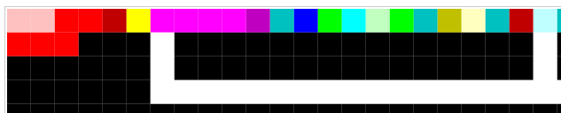

## High-Level Overview

This sample program implements Baklava using two main loops:

1.  Display the top 10 lines:

    - Display `n` spaces.
    - Display `21 - 2*n` asterisks.
    - Display a newline.

    where `n` equals 1, 2, ..., 10.

2.  Display the bottom 11 lines:

    - Display 21 asterisks.
    - Display a newline.

    then:

    - Display `10 - floor(m / 2)` spaces.
    - Display `m` asterisks.
    - Display a newline.

    where `m` equals 19, 17, ..., 1.

## Detailed Description

ASCII characters need to be encoded as numbers. The following numbers are
used:

- space: 32
- asterisk: 42
- newline: 10

Instructions are shown in the following format:

- Top, leftmost X/Y-Coordinate of instruction (zero-based) and `:`
- Instruction
- `#` and stack contents

The `>` instruction pops the two top stack items. If the second stack item is
greater than the top stack item, 1 pushed; otherwise, 0 is pushed.

Greater than example:

- Stack (before): ..., 5 (2nd), 4 (top)
- Stack (after): 1

Not greater than example:

- Stack (before): ..., 3 (2nd), 4 (top)
- Stack (after): 0

The data pointer (DP), controls the flow of the program. The program starts
at (0, 0), and DP points to the right. When DP hits an edge or black cell
it rotates clockwise. The program terminates when there is nowhere to go.

### Display n Spaces



#### First Space Loop Initialization

n = 10:

```
( 0,  0): push 2  # 2
( 0,  2): push 5  # 2, 5
( 0,  4): *       # 10
```

k = n:

```
( 0,  5): dup     # 10, 10
```

#### First space loop

Output " ":

```
( 0,  6): push 4  # n, k, 4
( 0, 10): dup     # n, k, 4, 4
( 0, 11): *       # n, k, 16
( 0, 12): dup     # n, k, 16, 16
( 0, 14): +       # n, k, 32
( 0, 15): outc    # n, k
```

k = k - 1:

```
( 0, 16): push 1  # n, k, 1
( 0, 17): -       # n, k - 1
( 0, 18): dup     # n, k - 1, k - 1
( 0, 19): push 1  # n, k - 1, k - 1, 1
( 0, 20): !       # n, k - 1, k - 1, 0
( 0, 21): >       # n, k - 1, (k - 1) > 0
```

If (k - 1) > 0, DP points down; otherwise, DP still points right.

```
( 0, 22): DP+     # n, k - 1
```

For the case where (k - 1) > 0, a bunch of no op's (the white cells) are
executed, and the program goes back to (0, 6). Otherwise, the program
continues on to (0, 23).

## Further Reading

If you'd like to learn more about the Piet language, see the [Official Site][3].

## Credits

The painting used in this image is called [Boogie-Woogie Victory][1],
painted by [Piet Mondrian][2] in 1944 in expectation of victory in World War
II.

## Thanks

Thanks to `alope107` for introducing me to the Piet esoteric language and
for helping me fix a termination issue in this program.

[1]: https://www.piet-mondrian.org/victory-boogie-woogie.jsp
[2]: https://en.wikipedia.org/wiki/Piet_Mondrian
